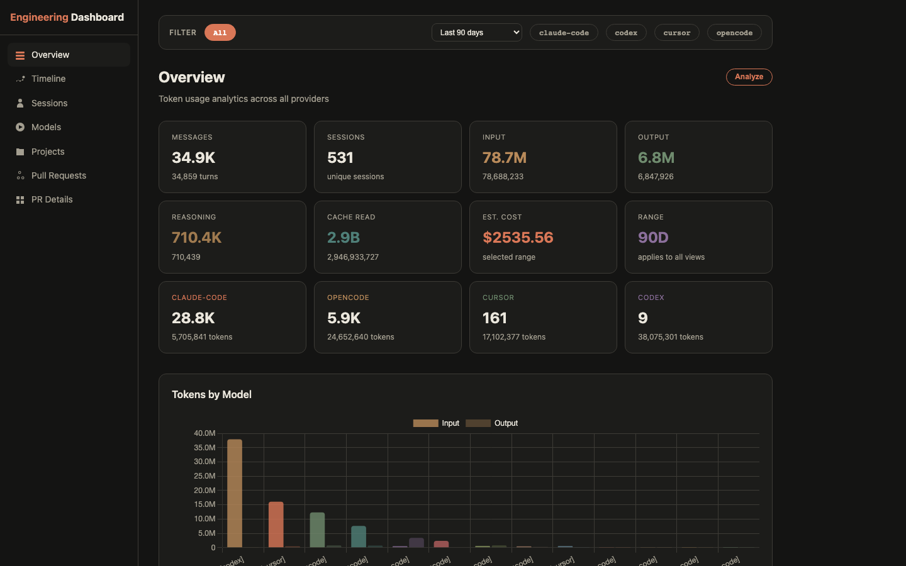
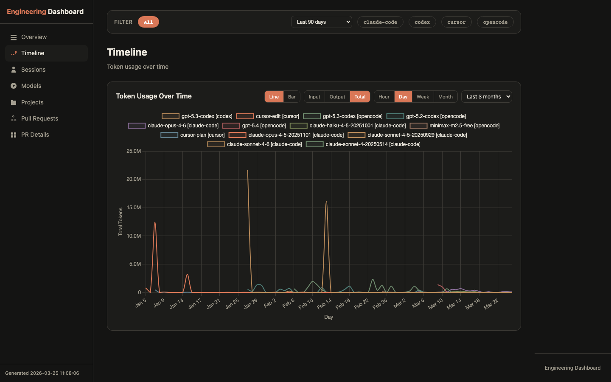
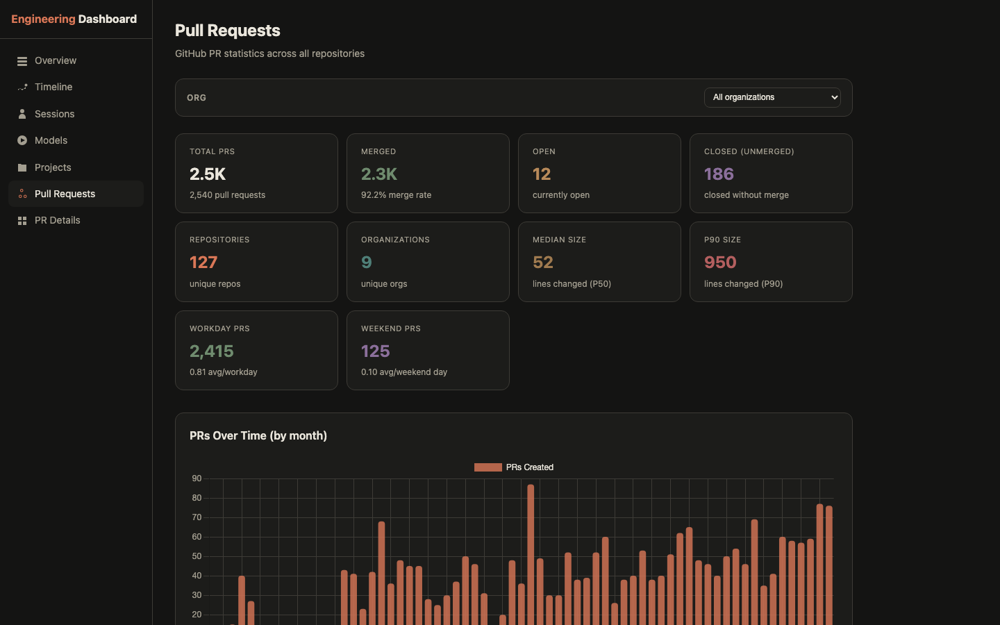
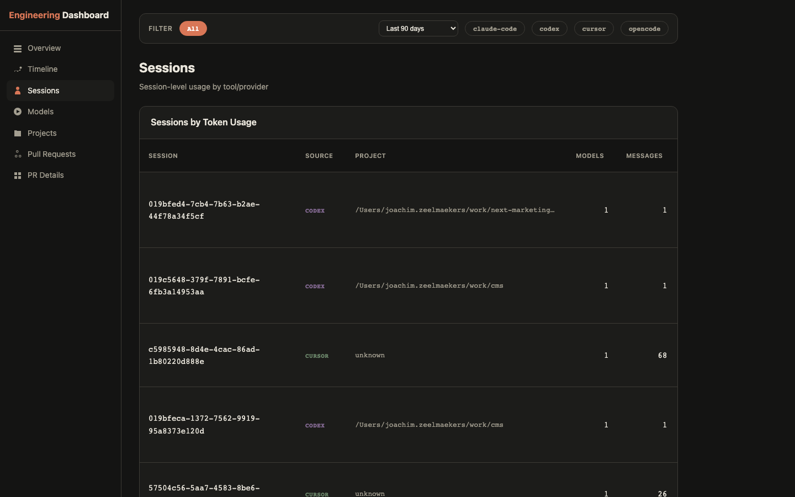

# Engineering Dashboard

A self-contained HTML dashboard that aggregates AI tool usage, GitHub PR statistics, and code review activity into a single view.



## Quick Start

```bash
cp tools/engineering-report/config.example.json tools/engineering-report/config.json
# Edit config.json to enable/disable providers
make engineering-report
```

## Features

### AI Token Usage

Track token consumption and estimated costs across multiple AI coding assistants. Filter by provider, date range, and drill down into individual sessions.

- Per-model token breakdown (input, output, reasoning, cache) with estimated costs
- Monthly cost tracking
- Provider comparison (Claude Code, OpenCode, Cursor, Codex)
- Per-project usage breakdown



### GitHub Pull Requests

PR statistics across all your repositories, filterable by organization.

- Total PRs, merge rate, open/closed counts
- PRs over time (monthly bar chart)
- Average PRs per workday vs weekend day with 3-month rolling trend
- PR size percentiles (P25, P50, P75, P90, P95, P99) for lines changed, additions, deletions, and files
- Per-repository breakdown



### Code Reviews

Review activity across all organizations.

- Total reviews given with state breakdown (approved, commented, changes requested)
- Reviews over time (monthly), filterable by org

### Session Analytics

Explore individual coding sessions sorted by token usage, with drill-down into model breakdowns per session.



## Data Sources

| Provider | Source | Auto-detected |
|----------|--------|:---:|
| Claude Code | `~/.claude/stats-cache.json` + session JSONL | Yes |
| OpenCode | `~/.local/share/opencode/opencode.db` | Yes |
| Cursor | `~/Library/Application Support/Cursor/User/globalStorage/state.vscdb` | Yes |
| Codex | `~/.codex/sessions/**/*.jsonl` | Yes |
| GitHub | GraphQL API via `gh` CLI | Requires auth |

## Configuration

Copy the example config and enable the providers you use:

```bash
cp tools/engineering-report/config.example.json tools/engineering-report/config.json
```

```json
{
  "providers": {
    "claude-code": { "enabled": true },
    "opencode": { "enabled": false },
    "cursor": { "enabled": false },
    "codex": { "enabled": false }
  },
  "github": {
    "enabled": true,
    "history_start_year": 2020
  },
  "server": {
    "port": 9999
  },
  "max_reports": 3
}
```

All data is cached incrementally. The first run fetches full history; subsequent runs only fetch new data.

### Requirements

- Python 3.10+
- `gh` CLI (authenticated) for GitHub stats
- No pip dependencies (stdlib only)

## Commands

```bash
make engineering-report    # Generate and open the dashboard
make engineering-serve     # Live-reload server on localhost:9999
make prompt-analysis       # Analyze Claude/OpenCode session prompts
make clean                 # Clean all output directories
```
